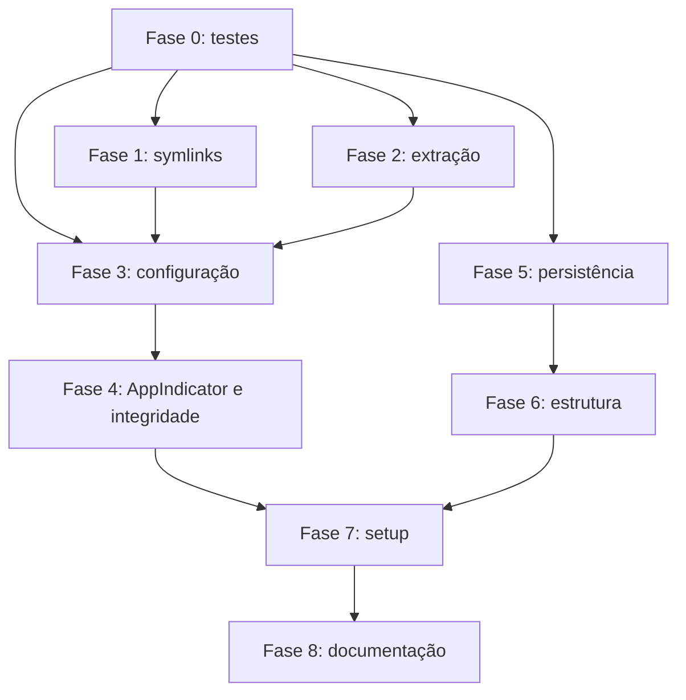

# Plano de implementação do `llama.tray`

Este documento organiza as melhorias em etapas pequenas e verificáveis. A ordem prioriza prevenção de perda de dados, consistência da configuração e segurança antes de refatorações estruturais.

## Como usar este plano

- Execute uma fase por vez.
- Mantenha cada item principal em uma alteração pequena e revisável.
- Marque um item somente depois de cumprir seus critérios de aceite.
- Rode primeiro os testes específicos da alteração e, depois, a validação geral.
- Não misture refatorações grandes com correções funcionais ou de segurança.
- Preserve compatibilidade com as configurações existentes em `~/.config/llama-tray/`.

## Legenda de prioridade

- **P0 — Crítica:** pode causar perda de dados ou execução insegura.
- **P1 — Alta:** pode deixar o aplicativo inconsistente ou inutilizável.
- **P2 — Média:** melhora confiabilidade, manutenção e diagnóstico.
- **P3 — Baixa:** documentação, acabamento e conveniência.

---

# Visão geral das fases

- [ ] **Fase 0:** preparar infraestrutura mínima de testes e qualidade
- [ ] **Fase 1:** tornar a integração com o terminal segura
- [ ] **Fase 2:** tornar instalação e extração de versões seguras e transacionais
- [ ] **Fase 3:** tornar a aplicação de configurações transacional
- [ ] **Fase 4:** corrigir AppIndicator e validação de integridade
- [ ] **Fase 5:** tornar persistência atômica e validada
- [x] **Fase 6:** melhorar tipos, responsabilidades e estrutura do código
- [ ] **Fase 7:** fortalecer `setup.sh` e empacotamento
- [ ] **Fase 8:** completar documentação e validação final

## Dependências entre fases



---

# Fase 0 — Infraestrutura mínima de testes e qualidade

**Prioridade:** P1  
**Objetivo:** permitir que as correções seguintes sejam feitas com segurança e evitar regressões.

## 0.1 Criar manifesto do projeto

- [x] Criar `pyproject.toml`.
- [x] Declarar a versão mínima suportada do Python.
- [x] Configurar `pytest`.
- [x] Configurar Ruff para lint e formatação.
- [x] Configurar o verificador de tipos escolhido, considerando as limitações de stubs do PyGObject.
- [x] Separar dependências de desenvolvimento das dependências fornecidas pelo sistema operacional.
- [ ] Documentar que PyGObject e AppIndicator normalmente são instalados pelo gerenciador de pacotes da distribuição.

### Critérios de aceite

- [x] `python3 -m pytest` pode ser executado mesmo antes de existirem muitos testes.
- [x] `ruff check src tests` executa com configuração versionada.
- [x] `ruff format --check src tests` executa com configuração versionada.
- [x] O manifesto não tenta instalar silenciosamente bibliotecas GTK de sistema de forma incompatível.

## 0.2 Criar estrutura inicial de testes

- [x] Criar `tests/`.
- [x] Criar fixtures para diretórios temporários de cache, configuração, instalação e binários.
- [x] Garantir que testes nunca escrevam em `~/.config`, `~/.cache` ou `~/.local` reais.
- [x] Criar testes iniciais para:
  - [x] `get_version_id()`.
  - [x] `parse_version_id()`.
  - [x] `get_system_arch()` com arquiteturas conhecidas e desconhecidas.
  - [x] `get_asset_for_backend()` com releases simulados.
  - [x] `prepare_download()` com release existente e inexistente.
- [ ] Isolar ou simular `GLib.idle_add` nos testes do updater.

### Critérios de aceite

- [x] Todos os testes usam `tmp_path` ou diretórios explicitamente temporários.
- [x] Os testes não dependem de rede.
- [x] Os testes não precisam iniciar GTK nem criar um tray real.

## 0.3 Estabelecer validação local simples

- [x] Manter a validação executável localmente, sem workflow de CI.
- [ ] Criar, se for útil, um script curto como `scripts/check.sh` para reunir os comandos abaixo.
- [x] Não exigir sessão gráfica para os testes básicos.
- [x] Manter as ferramentas opcionais: a ausência de Ruff ou ShellCheck não deve impedir o uso do aplicativo.
- [x] Executar a validação antes de concluir cada fase relevante.

> CI fica deliberadamente fora do escopo. Para o tamanho e o ritmo atual do projeto, testes locais focados oferecem melhor relação entre benefício e manutenção.

### Comandos esperados

```bash
python3 -m py_compile src/main.py src/updater.py
python3 -m pytest
ruff check src tests
ruff format --check src tests
bash -n setup.sh
shellcheck setup.sh
```

---

# Problemas prioritários

# Fase 1 — Integração segura com o terminal

**Prioridade:** P0  
**Arquivos principais:** `src/updater.py`, testes do updater  
**Objetivo:** impedir remoção de arquivos do usuário e remover corretamente apenas links gerenciados pelo aplicativo.

## 1.1 Definir regras de propriedade dos symlinks

- [x] Considerar gerenciado somente um symlink cujo destino resolvido esteja dentro de `INSTALL_DIR`.
- [x] Nunca remover automaticamente arquivos regulares em `~/.local/bin`.
- [x] Nunca remover symlinks que apontem para instalações externas ao `llama.tray`.
- [x] Definir comportamento para conflito de nomes:
  - [x] retornar erro detalhado;
  - [x] manter o arquivo existente intacto;
  - [ ] exibir ao usuário quais binários não puderam ser integrados.
- [x] Decidir se será usado um manifesto de links gerenciados, por exemplo em `CONFIG_DIR` ou `LOG_DIR`.

## 1.2 Separar operações de limpeza e criação

- [x] Criar uma função para identificar links pertencentes ao aplicativo.
- [x] Criar uma função para remover todos os links pertencentes ao aplicativo.
- [x] Criar uma função para instalar os links da versão ativa.
- [x] Fazer a desativação funcionar mesmo quando a versão selecionada ainda não estiver instalada.
- [x] Ao trocar de versão, remover links antigos gerenciados antes de criar os novos.
- [x] Não retornar sucesso quando houver conflitos ou falhas parciais sem informar detalhes.

## 1.3 Integrar erros à interface

- [x] Substituir o retorno booleano genérico por um resultado que carregue erros e conflitos.
- [ ] Exibir falhas de integração na janela de configurações.
- [x] Não desfazer uma instalação válida apenas porque um link opcional não pôde ser criado.
- [ ] Registrar detalhes técnicos no stderr ou logger.

## 1.4 Testes obrigatórios

- [x] Cria links para todos os executáveis elegíveis.
- [x] Não cria links para bibliotecas `.so`.
- [x] Não apaga arquivo regular com o mesmo nome.
- [x] Não apaga symlink de terceiros.
- [x] Remove symlink que aponta para `INSTALL_DIR`.
- [x] Remove links antigos ao trocar de versão.
- [x] Desativar integração funciona sem uma versão instalada.
- [x] Uma falha parcial é retornada de forma explícita.

### Critérios de aceite da fase

- [x] Nenhum caminho regular existente em `~/.local/bin` é removido automaticamente.
- [x] A desativação elimina todos e somente os links gerenciados pelo aplicativo.
- [x] Trocas de backend e versão não deixam links obsoletos.
- [x] Os cenários acima possuem testes automatizados.

---

# Fase 2 — Download e extração seguros e transacionais

**Prioridade:** P0  
**Arquivo principal:** `src/updater.py`  
**Objetivo:** impedir escrita fora do diretório esperado e preservar instalações funcionais em caso de erro.

## 2.1 Criar política segura de membros TAR

A distribuição oficial do `llama.cpp` contém executáveis, bibliotecas compartilhadas, diretórios e cadeias de symlinks internas, por exemplo `libllama.so → libllama.so.0 → libllama.so.0.0.9949`. Esses links são necessários e devem ser preservados quando permanecerem dentro da instalação.

- [x] Rejeitar nomes de membros absolutos.
- [x] Rejeitar nomes de membros com componentes `..`.
- [x] Permitir diretórios e arquivos regulares.
- [x] Permitir symlinks relativos cujo destino normalizado permaneça dentro da raiz temporária de extração.
- [x] Rejeitar symlinks absolutos ou cujo destino escape da raiz temporária.
- [x] Resolver o destino relativo a partir do diretório que contém o symlink, não a partir da raiz global.
- [x] Permitir cadeias internas de symlinks usadas pelas bibliotecas `.so`.
- [x] Após a extração, validar que cada symlink continua dentro da instalação e não está quebrado.
- [x] Para hard links, aceitar somente alvos internos que correspondam a arquivo regular do mesmo pacote; rejeitar os demais.
- [x] Rejeitar dispositivos, FIFOs, sockets e outros arquivos especiais.
- [x] Usar `Path.resolve()` e `Path.is_relative_to()` para validar membros e destinos de links.
- [x] Para versões antigas do Python, implementar helper equivalente a `is_relative_to()`.
- [x] Avaliar o uso do filtro seguro de `tarfile` nas versões do Python que o suportam, sem bloquear os symlinks internos válidos do `llama.cpp`.
- [x] Não modificar os objetos `TarInfo` originais sem necessidade.

## 2.2 Extrair em diretório temporário

- [x] Criar diretório temporário dentro do mesmo filesystem de `INSTALL_DIR`.
- [x] Extrair o pacote somente nesse diretório.
- [x] Normalizar o diretório superior único sem enfraquecer as verificações.
- [x] Validar somente que symlinks internos permanecem dentro da instalação e resolvem para um alvo existente.
- [x] Preservar bibliotecas `.so`, symlinks internos, arquivo `LICENSE` e subdiretórios fornecidos pelo pacote.
- [x] Validar que os alvos finais das cadeias de bibliotecas são arquivos regulares dentro da instalação.
- [x] Não exigir que todos os arquivos do pacote sejam executáveis.
- [x] Remover o diretório temporário em qualquer erro ou cancelamento.

## 2.3 Publicar instalação de forma transacional

- [x] Não remover `target_dir` antes de validar completamente a nova extração.
- [x] Se já existir instalação:
  - [x] renomeá-la para um backup temporário;
  - [x] mover atomicamente a nova instalação para o destino;
  - [x] remover o backup somente após sucesso.
- [x] Restaurar o backup se a publicação falhar.
- [x] Garantir limpeza de backups abandonados de forma segura.
- [x] Tratar cancelamento separadamente de falha.

## 2.4 Melhorar o ciclo de vida do download

- [x] Evitar acesso a atributos internos frágeis como `response.fp.raw._sock` quando possível.
- [x] Manter timeout de conexão e leitura de forma compatível.
- [x] Garantir fechamento do descritor retornado por `mkstemp` em todos os caminhos.
- [x] Garantir exclusão do arquivo temporário em sucesso, erro e cancelamento.
- [ ] Diferenciar mensagens de download cancelado, falha de rede, hash inválido e extração inválida.
- [x] Não remover uma instalação anterior quando o download falhar.

## 2.5 Testes obrigatórios

- [x] Arquivo TAR válido é instalado.
- [x] TAR sem `llama-server` pode ser extraído; o aplicativo não valida o conteúdo funcional fornecido pelo pacote.
- [x] Caminho absoluto é rejeitado.
- [x] Nome de membro com `..` é rejeitado.
- [x] Symlink relativo interno é preservado.
- [x] Cadeia interna como `libllama.so → libllama.so.0 → arquivo real` é preservada e validada.
- [x] Symlink absoluto é rejeitado.
- [x] Symlink relativo que escapa da raiz é rejeitado.
- [x] Symlink quebrado é rejeitado após a extração.
- [ ] Hard link interno para arquivo regular segue a política definida.
- [ ] Hard link externo ou inválido é rejeitado.
- [x] Arquivo especial é rejeitado.
- [ ] Prefixos semelhantes não escapam do diretório, como `install` e `install-malicioso`.
- [x] Falha de extração preserva instalação anterior.
- [x] Falha ao publicar restaura instalação anterior.
- [ ] Cancelamento limpa temporários e preserva instalação anterior.
- [ ] Hash incorreto impede extração.

### Critérios de aceite da fase

- [x] Um pacote malformado não consegue escrever fora do diretório temporário.
- [x] A versão previamente instalada continua funcional após qualquer falha.
- [x] O destino final só aparece depois da validação completa.
- [x] Não permanecem temporários após sucesso, erro ou cancelamento.

---

# Fase 3 — Aplicação transacional de configurações

**Prioridade:** P1  
**Arquivo principal:** `src/main.py`  
**Objetivo:** impedir combinações inválidas de `current_version` e `backend` após falha ou cancelamento.

## 3.1 Separar estado pendente de estado persistido

- [x] Criar uma estrutura para representar as configurações pendentes da janela.
- [x] Manter somente backend e versão sem persistir até a operação poder ser concluída.
- [x] Não alterar backend ou versão em `logic_app.config` antes de validar ou instalar a versão escolhida.
- [x] Persistir perfis, perfil ativo, integração de terminal e autostart independentemente do resultado do download.
- [x] Garantir que fechar a janela descarte somente o estado pendente de versão/backend.

## 3.2 Definir fluxo para versão já instalada

- [ ] Validar todos os campos.
- [ ] Aplicar perfis e configuração em uma única operação.
- [ ] Atualizar symlinks de forma segura.
- [ ] Atualizar autostart.
- [ ] Reiniciar o servidor somente depois da persistência bem-sucedida.
- [ ] Se uma integração opcional falhar, informar sem corromper a configuração principal.

## 3.3 Definir fluxo para versão que precisa de download

- [ ] Validar metadados antes de persistir qualquer alteração.
- [ ] Guardar explicitamente backend e versão associados ao download.
- [ ] Não consultar novamente widgets GTK para descobrir o backend em `on_download_done`.
- [ ] Após download e instalação bem-sucedidos:
  - [ ] persistir perfis;
  - [ ] persistir backend e versão juntos;
  - [ ] atualizar symlinks;
  - [ ] atualizar autostart;
  - [ ] reiniciar o servidor, se necessário.
- [ ] Em erro ou cancelamento, manter toda a configuração anterior.
- [ ] Exibir mensagem explícita de cancelamento quando aplicável.

## 3.4 Tratar falhas parciais

- [ ] Definir quais operações são obrigatórias e quais são opcionais.
- [ ] Se salvar configuração falhar, não reiniciar o servidor.
- [ ] Se autostart falhar, informar o usuário e manter o modo anterior ou registrar claramente a divergência.
- [ ] Se symlinks falharem, preservar a instalação e informar conflitos.
- [ ] Evitar múltiplas gravações sucessivas de configuração para uma única ação.

## 3.5 Testes obrigatórios

- [ ] Download falho não altera backend nem versão ativos.
- [ ] Cancelamento não altera configuração nem perfis persistidos.
- [ ] Download bem-sucedido salva backend e versão juntos.
- [ ] Versão instalada é aplicada sem download.
- [ ] Reinício usa a nova combinação de versão e backend.
- [ ] Falha de persistência impede reinício.
- [ ] A callback de conclusão usa dados imutáveis da operação, não o estado atual dos widgets.

### Critérios de aceite da fase

- [ ] Nunca existe estado persistido apontando para uma combinação não instalada por causa de download falho.
- [ ] Fechar a janela durante download não aplica alterações pendentes.
- [ ] Configuração e perfis são persistidos somente no momento correto.

---

# Fase 4 — AppIndicator, integridade e compatibilidade

**Prioridade:** P1  
**Arquivos principais:** `src/main.py`, `src/updater.py`, `README.md`

## 4.1 Corrigir o fallback do AppIndicator

Escolher uma das estratégias:

### Estratégia A — fallback real

- [x] Tentar `AyatanaAppIndicator3` primeiro.
- [x] Tentar `AppIndicator3` como fallback.
- [x] Usar um alias interno comum para evitar condicionais espalhadas.
- [ ] Testar seleção do namespace com imports simulados.

### Estratégia B — dependência obrigatória

- [ ] Remover a mensagem enganosa de fallback.
- [ ] Encerrar com mensagem clara informando a dependência ausente.
- [ ] Incluir instruções por distribuição no README.

### Critérios de aceite

- [ ] O símbolo do AppIndicator nunca fica possivelmente não inicializado.
- [ ] A ausência da dependência produz erro acionável em vez de `NameError`.

## 4.2 Definir política obrigatória de integridade

- [x] Decidir se downloads sem SHA256 serão recusados.
- [x] Preferencialmente, exigir digest válido antes da instalação.
- [x] Validar formato do SHA256 esperado.
- [x] Comparar hashes de forma consistente e sem diferenças de capitalização.
- [x] Informar claramente quando a release não fornece digest.
- [ ] Alinhar o comportamento com o texto do README.

## 4.3 Validar metadados da release

- [ ] Rejeitar asset sem URL de download.
- [ ] Ajustar os tipos de retorno para representar corretamente `None`.
- [ ] Ignorar drafts quando aplicável.
- [ ] Definir se prereleases devem ser mostradas.
- [ ] Não assumir silenciosamente `x64` em arquitetura desconhecida.
- [ ] Exibir mensagem de arquitetura não suportada.
- [ ] Documentar que os assets selecionados são builds Ubuntu, caso continue assim.

## 4.4 Testes obrigatórios

- [ ] Asset sem URL é rejeitado.
- [ ] Asset sem digest segue a política definida.
- [ ] Digest inválido é rejeitado.
- [ ] Arquitetura desconhecida retorna erro suportado.
- [ ] Draft/prerelease segue a política documentada.

---

# Persistência não é atômica nem validada

# Fase 5 — Persistência atômica, validada e recuperável

**Prioridade:** P1  
**Arquivos principais:** inicialmente `src/main.py`; posteriormente módulo próprio de persistência  
**Objetivo:** evitar corrupção silenciosa de `config.json` e `profiles.json`.

## 5.1 Definir schemas internos

- [ ] Definir os campos permitidos em configuração:
  - [ ] `current_version`: string;
  - [ ] `backend`: `cpu` ou `vulkan`;
  - [ ] `terminal_integration`: booleano;
  - [ ] `current_profile`: string não vazia;
  - [ ] `autostart`: valor permitido.
- [ ] Definir schema de perfil:
  - [ ] `name`: string não vazia;
  - [ ] `env_vars`: string;
  - [ ] `args`: string.
- [ ] Rejeitar ou normalizar campos com tipos incorretos.
- [ ] Definir tratamento para chaves desconhecidas visando compatibilidade futura.
- [ ] Garantir nomes únicos de perfis.
- [ ] Garantir pelo menos um perfil válido.
- [ ] Garantir que `current_profile` aponte para perfil existente.

## 5.2 Implementar escrita atômica

- [ ] Criar helper único para JSON atômico.
- [ ] Criar arquivo temporário no mesmo diretório do destino.
- [ ] Escrever JSON completo no temporário.
- [ ] Executar `flush()`.
- [ ] Executar `os.fsync()` quando apropriado.
- [ ] Aplicar permissões adequadas.
- [ ] Publicar com `os.replace()`.
- [ ] Remover temporário em caso de falha.
- [ ] Propagar erro ao chamador em vez de apenas imprimir e continuar.

## 5.3 Implementar leitura validada e recuperação

- [ ] Diferenciar arquivo ausente, JSON inválido e schema inválido.
- [ ] Preservar arquivo inválido para diagnóstico, por exemplo com sufixo `.invalid` ou timestamp.
- [ ] Não sobrescrever imediatamente um arquivo corrompido sem preservar evidência.
- [ ] Carregar defaults seguros quando a recuperação for possível.
- [ ] Informar o usuário sobre a recuperação.
- [ ] Registrar caminho e motivo do erro sem expor variáveis sensíveis desnecessariamente.

## 5.4 Versionar o formato de configuração

- [ ] Adicionar `schema_version` à configuração.
- [ ] Definir versão inicial.
- [ ] Transformar a migração atual de `env_vars` e `args` em migração explícita.
- [ ] Tornar migrações idempotentes.
- [ ] Executar migrações antes da validação final.
- [ ] Criar backup antes de uma migração destrutiva.

## 5.5 Melhorar a API de persistência

- [ ] Fazer `save()` retornar sucesso detalhado ou lançar exceção específica.
- [ ] Evitar que `set()` grave o arquivo a cada campo alterado em operações compostas.
- [ ] Criar operação para salvar configuração completa de forma atômica.
- [ ] Considerar salvar configuração e perfis como uma transação lógica com rollback ou ordem segura.
- [ ] Não ocultar falhas de I/O apenas com `print`.

## 5.6 Testes obrigatórios

- [ ] Arquivo ausente gera defaults.
- [ ] JSON truncado é preservado e recuperado.
- [ ] Configuração com tipos inválidos é rejeitada ou normalizada conforme política.
- [ ] Backend desconhecido é rejeitado.
- [ ] Autostart desconhecido é rejeitado.
- [ ] Lista de perfis vazia cria perfil padrão.
- [ ] Perfis duplicados são tratados.
- [ ] Perfil atual inexistente é corrigido.
- [ ] Falha durante escrita mantém o arquivo anterior intacto.
- [ ] Migração antiga funciona e é idempotente.
- [ ] Permissões e diretórios são criados corretamente.

### Critérios de aceite da fase

- [ ] Interrupção durante gravação não deixa JSON parcial no caminho final.
- [ ] Configuração inválida não causa falha posterior difícil de diagnosticar.
- [ ] Migrações têm testes e versão explícita.
- [ ] Erros de persistência chegam à interface e impedem ações dependentes.

---

# Qualidade e manutenção

# Fase 6 — Tipagem, responsabilidades e estrutura

**Prioridade:** P2  
**Objetivo:** reduzir o acoplamento de `main.py` sem alterar o comportamento do aplicativo.

## 6.1 Limpeza imediata e de baixo risco

- [x] Remover import duplicado/não utilizado de `copy`.
- [x] Remover `Callable` não utilizado em `updater.py` ou utilizá-lo corretamente.
- [x] Corrigir o tipo de retorno de `prepare_download()`.
- [x] Tipar `self.process` como `Optional[subprocess.Popen[str]]`.
- [x] Capturar referências locais do processo antes de `terminate()`, `wait()` e `kill()`.
- [x] Adicionar tipos aos callbacks de download.
- [x] Adicionar tipos aos métodos principais das janelas.
- [x] Configurar exceções conhecidas para diagnósticos dinâmicos do PyGObject sem desabilitar toda a análise.

## 6.2 Extrair persistência e domínio

Ordem recomendada:

- [x] Extrair `LlamaConfig` para `src/config.py`.
- [x] Extrair `LlamaProfilesManager` para `src/profiles.py`.
- [x] Extrair `LlamaProcessManager` to `src/process_manager.py`.
- [x] Ajustar imports e instalação em `setup.sh` para copiar todos os módulos.
- [x] Manter interfaces públicas pequenas e explícitas.
- [x] Evitar dependência de GTK nos módulos de configuração e perfis.
- [x] Injetar caminhos e callbacks para facilitar testes.

## 6.3 Extrair interface gráfica progressivamente

- [x] Criar `src/ui/` como pacote Python (Modularizado no diretório raiz `src/` como `ui_*.py` para manter compatibilidade com a cópia direta de arquivos Python do script de setup).
- [x] Extrair `LogsWindow`.
- [x] Extrair `SettingsWindow`.
- [x] Manter `LlamaTrayApp` como coordenador principal.
- [x] Evitar que widgets acessem diretamente estruturas internas mutáveis.
- [x] Introduzir pequenos modelos de estado ou serviços, sem framework adicional.

## 6.4 Melhorar tratamento de erros e logging

- [x] Definir exceções específicas para configuração, download, extração e integração.
- [x] Evitar `except Exception` onde seja possível tratar erros conhecidos.
- [x] Não ignorar silenciosamente falhas relevantes.
- [x] Diferenciar mensagens para usuário de detalhes técnicos de log.
- [x] Definir logger do próprio aplicativo além do logger do `llama-server`.
- [x] Evitar registrar conteúdo sensível das variáveis de ambiente.

## 6.5 Melhorar controle do processo

- [x] Avaliar o risco de `preexec_fn` em aplicação com threads.
- [x] Preferir mecanismos que não executem Python entre `fork` e `exec`.
- [x] Definir claramente se o processo inteiro ou o grupo de processos deve ser encerrado.
- [x] Se necessário, enviar sinais ao grupo criado por `start_new_session=True`.
- [x] Fechar pipes explicitamente.
- [x] Garantir que estado e callbacks permaneçam corretos em corridas entre saída natural e `stop()`.
- [x] Criar testes com processo auxiliar curto.

## 6.6 Melhorar a experiência da janela de configurações

- [x] Validar nome vazio de perfil com mensagem visual.
- [x] Validar nome duplicado com mensagem visual.
- [x] Impedir que o campo mostre valor diferente do estado realmente salvo.
- [x] Confirmar exclusão de perfil quando houver dados personalizados.
- [x] Informar claramente alterações não salvas.
- [x] Definir comportamento ao tentar fechar a janela durante download.

## 6.7 Critérios de aceite da fase

- [x] `main.py` deixa de conter persistência e gerenciamento direto do processo.
- [x] Módulos não gráficos podem ser importados e testados sem iniciar GTK.
- [x] Refatorações não mudam caminhos de dados nem formato de configuração sem migração.
- [x] Testes existentes continuam passando após cada extração.
- [x] Não existem imports duplicados ou tipos de retorno sabidamente incorretos.

---

# Instalação e documentação

# Fase 7 — Fortalecer `setup.sh` e instalação

**Prioridade:** P2  
**Arquivo principal:** `setup.sh`

## 7.1 Tornar o script previsível

- [ ] Adicionar `set -euo pipefail` com tratamento consciente de comandos opcionais.
- [ ] Calcular o diretório do próprio script.
- [ ] Usar caminhos absolutos derivados desse diretório para copiar `src/` e `data/`.
- [ ] Permitir execução a partir de outro diretório de trabalho.
- [ ] Usar funções pequenas para validação, instalação e limpeza.
- [ ] Adicionar handler de erro com mensagem clara.
- [ ] Só imprimir sucesso após todas as operações obrigatórias terminarem.

## 7.2 Adicionar modo não interativo

- [ ] Suportar `--install`.
- [ ] Suportar `--uninstall`.
- [ ] Suportar `--purge` ou `--full-cleanup`.
- [ ] Suportar `--help`.
- [ ] Manter menu interativo quando nenhum argumento for informado, se desejado.
- [ ] Retornar códigos de saída consistentes.
- [ ] Exigir confirmação adicional antes de apagar configurações e binários.

## 7.3 Verificar dependências

- [ ] Verificar `python3`.
- [ ] Verificar importação de `gi`.
- [ ] Verificar GTK 3.
- [ ] Verificar Notify.
- [ ] Verificar Ayatana AppIndicator ou fallback escolhido.
- [ ] Verificar ferramentas opcionais de cache e informar quando ausentes.
- [ ] Não tentar instalar pacotes automaticamente sem consentimento.
- [ ] Exibir nomes de pacotes sugeridos por distribuição.

## 7.4 Instalar a nova estrutura corretamente

- [ ] Se módulos forem extraídos, copiar a árvore completa de `src/`, não apenas `src/*.py`.
- [ ] Preservar permissões necessárias.
- [ ] Remover bytecode ou arquivos temporários da instalação.
- [ ] Validar o wrapper gerado.
- [ ] Considerar usar `python3 -I` apenas se compatível com o modelo de instalação.
- [ ] Verificar que o desktop entry aponta para o wrapper correto.

## 7.5 Tornar desinstalação segura

- [ ] Remover somente arquivos instalados pelo projeto.
- [ ] Reutilizar a lógica segura de identificação de symlinks.
- [ ] Não usar padrões amplos para apagar ícones de terceiros.
- [ ] Tratar diretórios inexistentes sem mensagens confusas.
- [ ] Preservar dados por padrão.
- [ ] Exigir confirmação explícita no full cleanup.
- [ ] Informar exatamente quais diretórios serão apagados.

## 7.6 Testes do instalador

- [ ] `bash -n setup.sh` passa.
- [ ] ShellCheck passa sem alertas relevantes.
- [ ] `--help` funciona sem interação.
- [ ] Opção inválida retorna código diferente de zero.
- [ ] Instalação funciona com `HOME` temporário em teste.
- [ ] Instalação funciona quando chamada fora da raiz do repositório.
- [ ] Desinstalação preserva configurações.
- [ ] Full cleanup remove apenas a árvore temporária esperada.
- [ ] Reinstalação é idempotente.

### Critérios de aceite da fase

- [ ] Falhas de cópia não terminam com mensagem de sucesso.
- [ ] O script pode ser automatizado sem entrada interativa.
- [ ] Instalação e desinstalação são testáveis com `HOME` isolado.
- [ ] Arquivos externos nunca são removidos.

---

# Fase 8 — Documentação, licença e validação final

**Prioridade:** P3  
**Arquivos principais:** `README.md`, novo arquivo de licença e documentação complementar

## 8.1 Atualizar README

- [ ] Corrigir a descrição dos diretórios usados.
- [ ] Documentar cache de releases.
- [ ] Documentar integração com terminal e política de conflitos.
- [ ] Documentar instalação, desinstalação e full cleanup.
- [ ] Documentar `llama-tray --autostart`.
- [ ] Documentar formatos de `config.json` e `profiles.json` em alto nível.
- [ ] Documentar backends suportados.
- [ ] Documentar arquiteturas suportadas.
- [ ] Documentar política de prereleases.
- [ ] Documentar política de SHA256.
- [ ] Explicar que argumentos e variáveis de ambiente são fornecidos ao `llama-server`.
- [ ] Alertar para não colocar segredos sensíveis em configurações sem proteção adequada.

## 8.2 Instruções por distribuição

- [ ] Adicionar dependências para Ubuntu/Debian.
- [ ] Adicionar dependências para Fedora, se suportado.
- [ ] Adicionar dependências para Arch Linux, se suportado.
- [ ] Indicar claramente distribuições não testadas.
- [ ] Explicar limitações dos binários Ubuntu do `llama.cpp` em outras distribuições.
- [ ] Documentar requisitos de Vulkan quando esse backend for selecionado.

## 8.3 Licença e contribuição

- [ ] Escolher uma licença compatível com o objetivo do projeto.
- [ ] Adicionar arquivo `LICENSE`.
- [ ] Informar a licença no README.
- [ ] Opcionalmente criar `CONTRIBUTING.md`.
- [ ] Documentar como executar testes e ferramentas de qualidade.
- [ ] Documentar como reportar problemas sem incluir dados sensíveis.

## 8.4 Documentar arquitetura e decisões de segurança

- [ ] Criar uma seção curta de arquitetura.
- [ ] Explicar a separação entre interface, processo, updater e persistência.
- [ ] Documentar a política de propriedade de symlinks.
- [ ] Documentar extração em diretório temporário e publicação atômica.
- [ ] Documentar recuperação de configuração inválida.
- [ ] Documentar locais onde logs e backups podem existir.

## 8.5 Validação final

- [ ] Rodar toda a suíte de testes.
- [ ] Rodar lint e formatação.
- [ ] Rodar verificação de tipos.
- [ ] Rodar ShellCheck.
- [ ] Testar instalação limpa em `HOME` temporário.
- [ ] Testar upgrade preservando configuração antiga.
- [ ] Testar download CPU.
- [ ] Testar download Vulkan.
- [ ] Testar hash inválido.
- [ ] Testar cancelamento.
- [ ] Testar troca de versão com servidor em execução.
- [ ] Testar autostart nos três modos.
- [ ] Testar ausência de AppIndicator.
- [ ] Testar conflito em `~/.local/bin`.
- [ ] Testar desinstalação e full cleanup.

---

# Checklist de regressão manual por release

## Inicialização

- [ ] Aplicativo inicia sem configuração anterior.
- [ ] Aplicativo inicia com configuração existente.
- [ ] Configuração inválida produz recuperação compreensível.
- [ ] Uma segunda ativação não cria comportamento inesperado.

## Servidor

- [ ] Servidor inicia com perfil ativo.
- [ ] Argumentos com espaços e aspas funcionam.
- [ ] Variáveis de ambiente são aplicadas.
- [ ] Stop encerra o processo esperado.
- [ ] Quit encerra o processo esperado.
- [ ] Saída inesperada atualiza ícone, menu e notificação.
- [ ] Logs são gravados e rotacionados.

## Atualização

- [ ] Releases são carregadas online.
- [ ] Cache funciona offline.
- [ ] Versões locais aparecem offline.
- [ ] Download mostra progresso.
- [ ] Download cancelado não altera configuração ativa.
- [ ] Download falho não remove versão anterior.
- [ ] Instalação concluída ativa a combinação correta de versão/backend.

## Perfis e configurações

- [ ] Criar perfil.
- [ ] Renomear perfil.
- [ ] Impedir nome vazio ou duplicado.
- [ ] Excluir perfil sem deixar referência inválida.
- [ ] Cancelar descarta alterações.
- [ ] Salvar persiste tudo atomicamente.

## Integrações do sistema

- [ ] Symlinks são criados sem sobrescrever arquivos externos.
- [ ] Symlinks antigos são removidos na troca de versão.
- [ ] Desativação remove somente links gerenciados.
- [ ] Desktop entry inicia o aplicativo.
- [ ] Autostart simples inicia apenas o tray.
- [ ] Autostart com servidor inicia tray e servidor.
- [ ] Modo desabilitado remove o autostart.

---

# Definição de pronto do projeto

- [ ] Nenhuma operação automática apaga arquivos regulares externos ao diretório do aplicativo.
- [ ] Downloads e extrações não substituem instalações válidas antes da validação completa.
- [ ] Configurações não ficam parcialmente aplicadas após erro ou cancelamento.
- [ ] JSON é salvo atomicamente e validado ao carregar.
- [ ] Falhas relevantes chegam ao usuário com mensagem acionável.
- [ ] Componentes não gráficos possuem testes sem depender de sessão GTK.
- [ ] Instalação e desinstalação funcionam em ambiente isolado.
- [ ] README descreve fielmente o comportamento implementado.
- [ ] Testes, lint, tipos e validações do shell passam.
